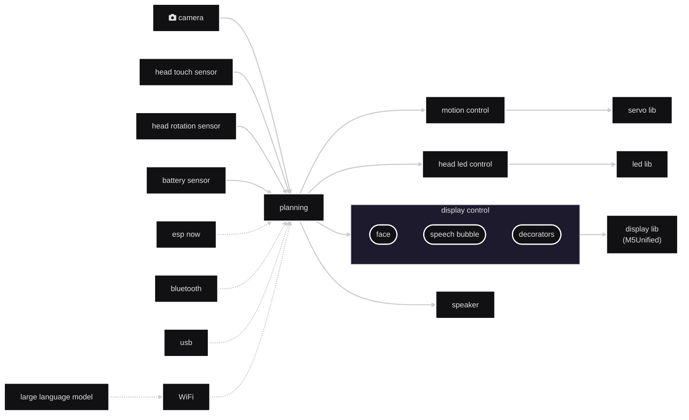

# StackChan Display

> [!WARNING]
> This library is WIP (*work in progress*) and unstable. Breaking changes can be installed easily!

*StackChan display* is an Arduino library to display stackchan faces.
*StackChan display* depends on only [U5Unified](https://github.com/m5stack/M5Unified) and drawing with it.

This library is based on [m5stack/StackChan](https://github.com/m5stack/StackChan), [botamochi6277/m5stack-avatar](https://github.com/botamochi6277/m5stack-avatar), and  [stack-chan/m5stack-avatar](https://github.com/stack-chan/m5stack-avatar).

## This Library Role for Stack-chan assembly

*StackChan display* is one of stack-chan components to control a display. Even if you use this library alone, “stack-chan” will not be complete.

## Note

M5StackChan Face is [m5stack/StackChan](https://github.com/m5stack/StackChan/tree/main/firmware/main/stackchan/avatar)

## TODO for Developers

- [x] Add ellipse eyes
- [x] Add cluster face
- [x] Add Base classes for facial components
- [ ] Add build CI tests
- [ ] Increase #decorators
- [ ] Add documents with doxygen
- [x] Add the diagram of system architecture
- [ ] Add pictures of stackchans in the real world
